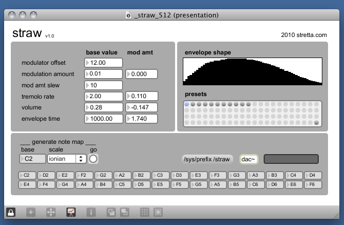

# straw

created by: stretta

straw is a simple FM synthesizer adapted to the monome interface. The x-axis is pitch and the y axis controls the amount of modulation of various synthesis parameters. 

To get started, turn on DSP (double click on dac~ and configure), and select a preset. 

http://vimeo.com/16173049